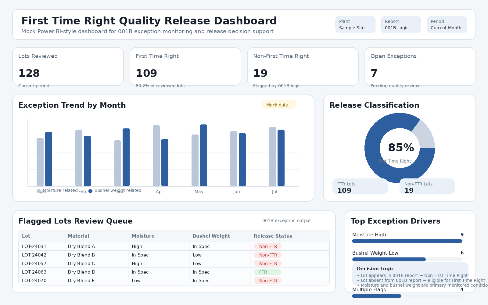
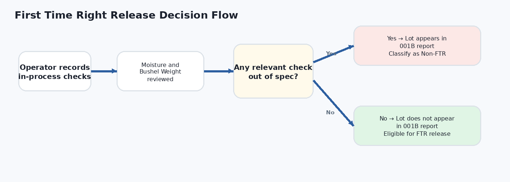

# First Time Right Quality Release Analytics

## Overview
This project presents a Power BI-based quality analytics workflow used to support finished product release decisions in a manufacturing environment.

The process centers on the **001B report**, which flags lots when operator-entered in-process checks fall outside specification. In this workflow, the most critical monitored variables were **moisture** and **bushel weight**, both of which influenced whether a lot could be classified as **First Time Right (FTR)** or **Non-First Time Right (Non-FTR)**.

## Business Problem
Quality teams need fast, accurate visibility into whether a production lot contains in-process exceptions that could affect release classification. Without a centralized exception-monitoring process, release decisions can become slower, less standardized, and more prone to manual review effort.

## My Role
I used Power BI-supported reporting logic to review 001B exception output and determine whether finished lots qualified for First Time Right release or required classification as Non-First Time Right.

## Decision Logic
- **Lot appears in 001B report** → one or more relevant in-process checks were out of specification → classify as **Non-First Time Right**
- **Lot does not appear in 001B report** → no flagged exception in the monitored workflow → eligible for **First Time Right** release

## Key Variables Monitored
- Moisture
- Bushel Weight

## Tools Used
- Power BI
- Exception-based quality reporting
- Manufacturing quality data review
- Release decision support

## Dashboard Preview

## Process Flow

## Business Value
- Improved visibility into lot-level exceptions affecting release decisions
- Supported more consistent First Time Right vs. Non-First Time Right classification
- Linked in-process quality signals to downstream finished product release outcomes
- Demonstrated how reporting logic can strengthen data-driven quality oversight

## Skills Demonstrated
- Power BI reporting
- Manufacturing analytics
- Exception monitoring
- Quality decision support
- Data interpretation
- Process control review

## Confidentiality Note
This repository is presented as a sanitized portfolio summary. Proprietary thresholds, internal report exports, lot identifiers, and plant-specific operational details have been removed or generalized.
