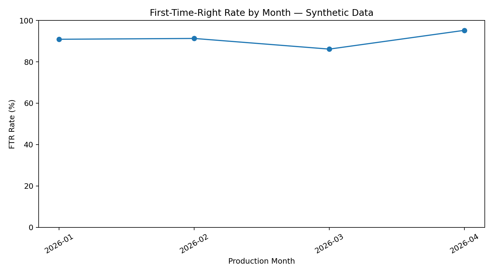
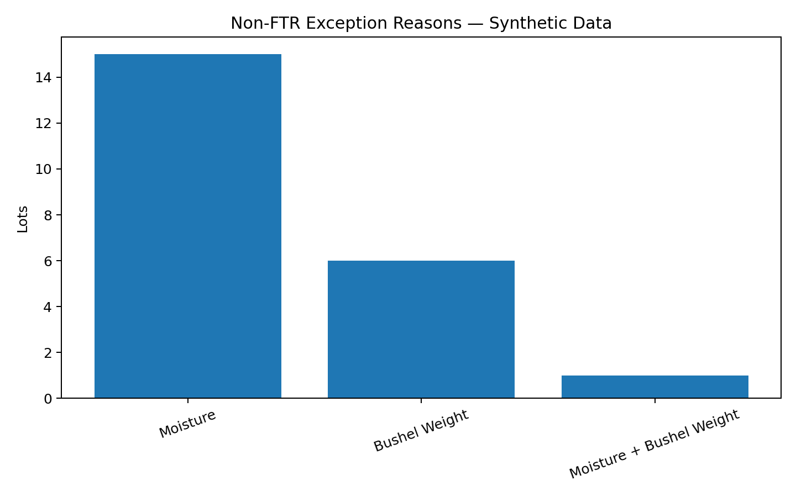
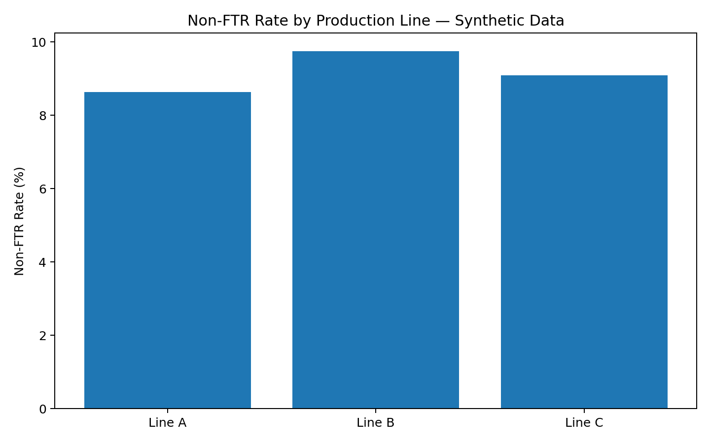

# First-Time-Right Quality Release Analytics

**Manufacturing quality analytics case study for lot-level exception monitoring and First-Time-Right (FTR) performance**

## Executive Summary

This portfolio project demonstrates how manufacturing quality data can be transformed into a decision-support model for **First-Time-Right (FTR)** monitoring.

The original business concept is based on an exception-reporting workflow in which relevant in-process quality exceptions can trigger additional review and affect FTR classification. For portfolio purposes, this repository uses **fully synthetic lot data and illustrative specification limits**. It does not contain proprietary company thresholds, lot identifiers, report exports, or production data.

## Business Problem

Quality and operations teams need fast visibility into:

- Which production lots contain monitored quality exceptions
- Whether exceptions are associated with moisture, bushel weight, or both
- Overall FTR and Non-FTR performance
- Whether exception patterns vary by time period, production line, or product family
- Which lots require additional review

A structured analytics layer can reduce reliance on manually interpreting disconnected records and make recurring quality-performance reviews more consistent.

## Portfolio Decision Logic

This demonstration models the sanitized business rule from the original project:

- **Flagged monitored exception** → lot appears in the simulated 001B exception view → **Non-FTR**
- **No flagged monitored exception** → lot does not appear in the simulated 001B exception view → **FTR**

The synthetic dataset uses illustrative limits solely to make the portfolio reproducible:

- Moisture: 8.5%–11.0%
- Bushel weight: 30.0–36.0

**These are not company specifications.**

## Dataset

`data/synthetic_quality_release_data.csv` contains 240 synthetic production lots with:

- Production date
- Production line
- Product family
- Moisture result
- Bushel-weight result
- In-spec flags
- Exception count
- Simulated 001B flag
- FTR classification
- Exception reason

Because the dataset is included, recruiters and interviewers can inspect the complete analytical logic without access to confidential manufacturing information.

## Key KPIs

The project supports:

- Total Lots
- FTR Lots
- Non-FTR Lots
- FTR Rate
- Non-FTR Rate
- Moisture Exception Lots
- Bushel Weight Exception Lots
- Exception Reason
- Line-level exception rate
- Monthly FTR trend

## Power BI Layer

The `power-bi/DAX_MEASURES.md` file contains reproducible DAX measures and a recommended dashboard structure.

Suggested dashboard components include KPI cards, monthly FTR trends, exception-reason analysis, line-level Non-FTR rates, lot-level exception tables, and slicers for date, line, product family, and FTR status.

## Portfolio Visuals

### FTR Trend


### Exception Drivers


### Production-Line Comparison


## Business Questions This Project Can Answer

1. What percentage of lots are First-Time-Right?
2. What are the primary drivers of Non-FTR classifications?
3. Are exception rates changing over time?
4. Do particular production lines show higher exception rates?
5. Which lots should be reviewed because of monitored exceptions?
6. How can quality signals be summarized for operational decision-making?

## Skills Demonstrated

- Power BI dashboard design
- DAX/KPI development
- Manufacturing analytics
- Quality analytics
- Data modeling
- Exception monitoring
- Trend analysis
- Root-cause exploration
- Business intelligence
- Data visualization
- Translating operational rules into analytical logic

## Repository Structure

```text
first-time-right-quality-release-analytics/
├── README.md
├── data/
│   ├── synthetic_quality_release_data.csv
│   └── kpi_summary.csv
├── assets/
│   ├── ftr_rate_by_month.png
│   ├── exception_reasons.png
│   └── non_ftr_by_line.png
└── power-bi/
    └── DAX_MEASURES.md
```

## Confidentiality & Scope

This is a sanitized portfolio case study. The business concept reflects general manufacturing-quality experience, but all data, product labels, lines, values, and specification limits in this repository are synthetic or generalized. No proprietary production records or confidential company specifications are included.

The project demonstrates an analytical approach; it should not be interpreted as a deployed production system.

## Interview Talking Point

> I created this portfolio case study to demonstrate how I translate manufacturing quality knowledge into business intelligence. I modeled a lot-level exception workflow using synthetic moisture and bushel-weight data, converted the business rules into FTR and Non-FTR classifications, created KPI measures, and designed the Power BI layer to show trends and exception drivers. The important part is not just the dashboard—it is connecting quality signals to an operational decision and making the logic transparent. In a production environment, I would use approved source-system data, validated specifications, governed definitions, and stakeholder-reviewed business rules.

## Why This Project Matters

This project connects **manufacturing domain knowledge with analytics and BI skills**. It is particularly relevant to manufacturing analytics, quality analytics, operations analytics, business intelligence, continuous improvement, and process-performance roles.
